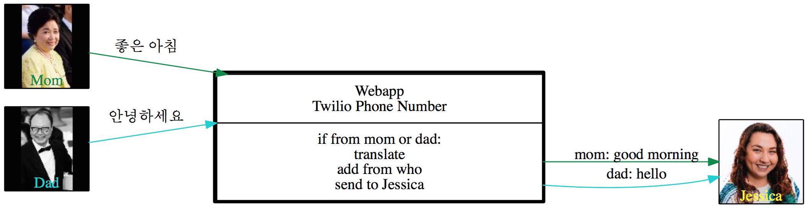
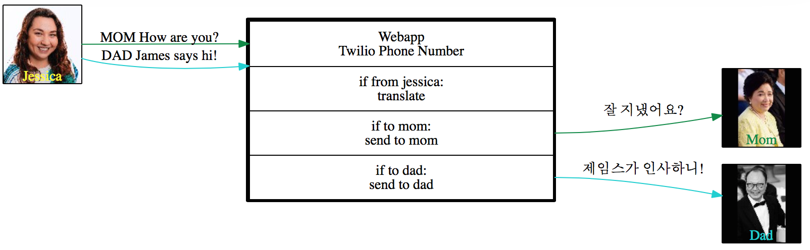

Text Translator
---------------

**Description**

This application handles [Twilio](https://www.twilio.com/) post request between 3 users: my mother-in-law, father-in-law and myself. It translast our messages to the appropirate langague and send a text message to the appropirate person.

For full details on the process of creating this web app: [Text Translator](http://chatasweetie.com/2017/01/14/text-translator-translating-text-messages-using-google-translate-api-twilio)    

 

### Technology Stack

**Application:** Python, WebApp2  
**APIs:** Google Translate, Twilio 

### About the Developer    
Jessica Dene Earley-Cha   
[Short Bio](https://chatasweetie.com/about-me/)   
[Linkedin](https://www.linkedin.com/in/jessicaearley)    
[Jessica's Blog](https://chatasweetie.com/)    
